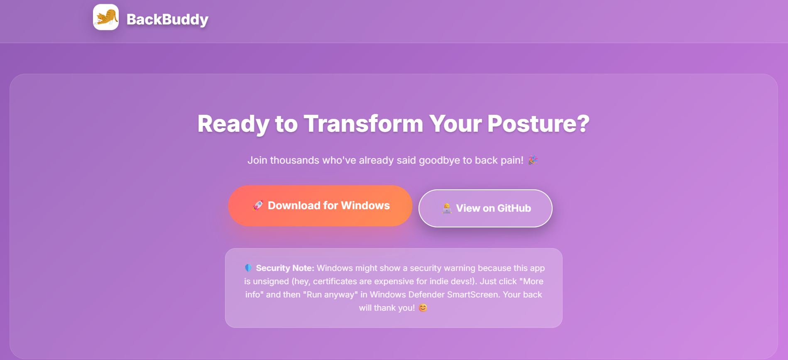
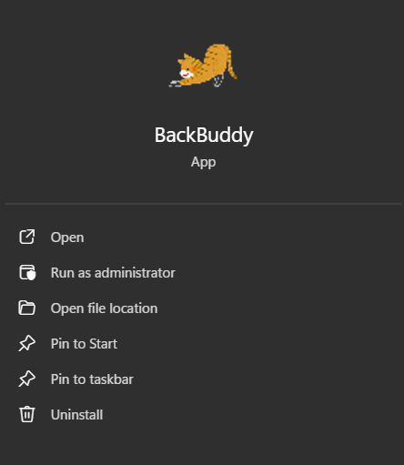
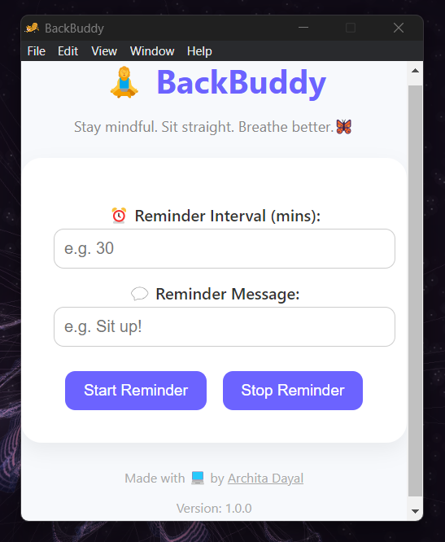

# 🧘‍♀️ BackBuddy

### 🌐 [Visit Landing Page](https://backbuddy.netlify.app/)


A friendly desktop app that reminds you to fix your posture at custom intervals.  
Built with Electron — stay comfy, stay focused. 💻


[](https://drive.google.com/file/d/1KKSNAnuhNj1N0tLGsmXe178TOCyckAd9/view?usp=sharing)


---

## 📦 Features
- ⏰ **Custom reminder intervals**
- 💬 **Custom messages** (e.g., *"Sit straight, pookie!"*)
- 🖥️ **Runs in background** with tray icon
- ⚙️ **Auto-launch** on startup
- 🎨 **Minimal UI** (cute and clean)

---

## 🧰 Tech Stack
- [Electron.js](https://www.electronjs.org/)
- [electron-store](https://www.npmjs.com/package/electron-store)
- [auto-launch](https://www.npmjs.com/package/auto-launch)

---

## 📥 Download

Click below to download the ready-to-install `.exe` installer:  
👉 [**Download BackBuddy for Windows**](https://drive.google.com/file/d/1KKSNAnuhNj1N0tLGsmXe178TOCyckAd9/view?usp=sharing)

⚠️ Since it's an unsigned `.exe` from an indie dev, Windows may show a warning:
> Click "More info" → "Run anyway".  
*It's safe — I built it myself!* 🛠️

---

## 🚀 Setup from Source (Dev Mode)

```bash
git clone https://github.com/arch5d/BackBuddy.git
cd BackBuddy
npm install
npm start
```
---

## 🛠️ Build Installer

npm run dist

---

## 🖼️ Preview








---


## 📄 License

This project is licensed under the MIT License — see the [**LICENSE**](https://github.com/arch5d/BackBuddy/blob/main/LICENSE) file for details.

---

Made with 💻 by [**@arch5d**](https://github.com/arch5d)

---